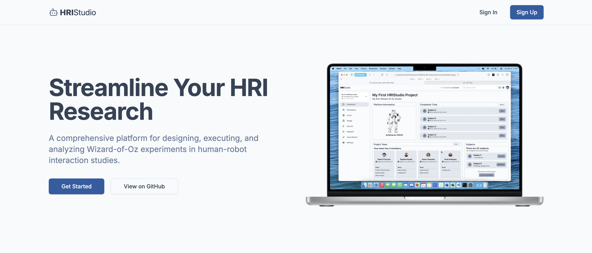

# [HRIStudio](https://www.hristudio.com)

A web platform for managing human-robot interaction studies, participants, and wizard-of-oz experiments.



## Features

- Role-based access control with granular permissions
- Study management and participant tracking
- Wizard-of-oz experiment support
- Data collection and analysis tools
- Secure authentication with Clerk
- Real-time participant management
- Study-specific data isolation

## Tech Stack

- [Next.js](https://nextjs.org/) - React framework with App Router
- [TypeScript](https://www.typescriptlang.org/) - Static type checking
- [Clerk](https://clerk.com/) - Authentication and user management
- [Drizzle ORM](https://orm.drizzle.team/) - TypeScript ORM
- [PostgreSQL](https://www.postgresql.org/) - Database
- [TailwindCSS](https://tailwindcss.com/) - Utility-first CSS
- [Shadcn UI](https://ui.shadcn.com/) - Component library
- [Radix UI](https://www.radix-ui.com/) - Accessible component primitives
- [Lucide Icons](https://lucide.dev/) - Icon system

## Getting Started

1. Clone the repository:
   ```bash
   git clone https://github.com/yourusername/hristudio.git
   ```

2. Install dependencies:
   ```bash
   pnpm install
   ```

3. Set up environment variables:
   ```bash
   cp .env.example .env
   ```

4. Set up the database:
   ```bash
   pnpm db:push
   ```

5. Start the development server:
   ```bash
   pnpm dev
   ```

6. Open [http://localhost:3000](http://localhost:3000) in your browser

## Project Structure

```
src/
├── app/              # Next.js app router pages and API routes
├── components/       # React components
│   ├── ui/          # Shadcn UI components
│   └── ...          # Feature-specific components
├── context/         # React context providers
├── db/              # Database schema and configuration
├── hooks/           # Custom React hooks
├── lib/             # Utility functions and permissions
└── types/           # TypeScript type definitions
```

## Development

- Run `pnpm db:studio` to open the Drizzle Studio database UI
- Use `pnpm lint` to check for code style issues
- Run `pnpm build` to create a production build

## License

This project is licensed under the MIT License - see the [LICENSE](LICENSE) file for details.

## Contributing

Contributions are welcome! Please read our [Contributing Guide](CONTRIBUTING.md) for details on our code of conduct and the process for submitting pull requests.